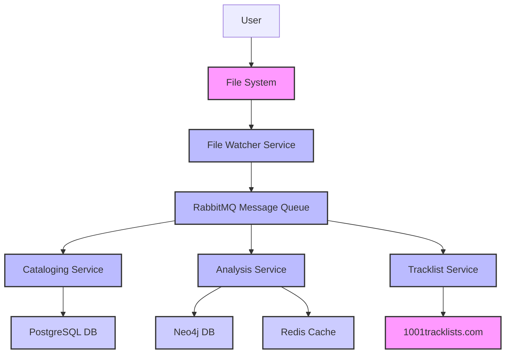

# tracktion Architecture Document

## Introduction

This document outlines the overall project architecture for **tracktion**, focusing on the backend systems, shared services, and non-UI specific concerns that will form the project's foundation. [cite\_start]Its primary goal is to serve as the guiding architectural blueprint for AI-driven development, ensuring consistency and adherence to chosen patterns and technologies[cite: 2604, 2605].

[cite\_start]The architecture is designed to support the core goals identified in the PRD[cite: 2604]:

  * Automatically cataloging a large music collection.
  * Analyzing recordings for metadata (BPM, key, mood).
  * Integrating with external data sources like `1001tracklists.com`.
  * Creating a scalable and extensible system for future development, such as a frontend application or new analysis features.

### **Starter Template or Existing Project**

Based on the information provided in the Project Brief, this appears to be a new (greenfield) project, although you mentioned having some portions of it prototyped. I will assume we are starting the architecture from scratch, with the intent of incorporating your prototyped code as we move forward. To ensure this is correct, please provide any details on existing code or starter templates you are using. If none are provided, I will proceed with the design from scratch, noting this assumption.

### **Change Log**

| Date | Version | Description | Author |
| :--- | :--- | :--- | :--- |
| August 16, 2025 | 1.0 | Initial architecture draft | Winston (Architect) |

## High Level Architecture

This section lays the foundation of the project's technical architecture. I will now present a draft of the key architectural components, patterns, and a high-level overview. Please review this holistic view of the system's design.

#### **Technical Summary**

The **tracktion** system will utilize a decoupled, microservices-based architecture built with Python 3.12+. Services will communicate asynchronously via a RabbitMQ message queue, enabling a scalable and resilient system. A file watcher will act as the entry point, triggering a chain of events that lead to the cataloging and enrichment of music files. Data will be stored across a polyglot persistence layer consisting of PostgreSQL for core relational data and Neo4j for graph-based analysis, with Redis providing caching capabilities. This design supports the primary goal of automated and extensible music library management.

#### **High Level Overview**

Based on the project's requirements for a scalable, decoupled system, we will adopt a **microservices architecture**. This approach allows for independent development and scaling of each service (e.g., the File Watcher, Cataloging Service, Analysis Service). The system will be deployed within a **monorepo** to streamline development and dependency management. The primary data flow will be event-driven: a file event triggers a message on the queue, which is then consumed by the appropriate services.

#### **High Level Project Diagram**



#### **Architectural and Design Patterns**

  * [cite\_start]**Microservices Architecture:** Decomposing the application into small, loosely-coupled services[cite: 2629]. - *Rationale:* This aligns with the need for scalability and asynchronous processing, as specified in the PRD, and makes the system easier to manage and extend.
  * **Event-Driven Communication:** Services communicate by publishing and subscribing to messages via RabbitMQ. - *Rationale:* This decouples the services, ensuring that a failure in one service does not halt the entire system. It is a highly scalable pattern that fits the file-watcher and processing pipeline model.
  * **Repository Pattern:** Abstracting data access logic behind a clean interface. - *Rationale:* This allows for the independent development and testing of service logic without direct dependencies on the underlying datastores. It also simplifies future migrations or changes to the database.
  * **Polyglot Persistence:** Using multiple datastores, each optimized for a specific data type. - *Rationale:* This is a necessity given the project's requirements for both relational (PostgreSQL) and graph (Neo4j) data. It allows us to leverage the strengths of each technology.

## Tech Stack

The technology stack has been updated to include an Object-Relational Mapper (ORM) and a database migration tool.

| Category | Technology | Version | Purpose | Rationale |
| :--- | :--- | :--- | :--- | :--- |
| **Language** | Python | 3.12+ | Primary development language | Explicitly requested for its rich ecosystem and suitability for data analysis tasks. |
| **Runtime** | N/A | N/A | Serverless functions | N/A, as this is a containerized microservices project, not a serverless one. |
| **Framework** | N/A | N/A | Web framework | N/A, as the MVP has no web interface. |
| **Database** | PostgreSQL | N/A | Primary data store | Excellent for structured data. Provides reliability, transactions, and complex query capabilities. |
| **Graph DB** | Neo4j | N/A | Graph data store | Perfect for the graph analysis and relationship modeling required by the project. |
| **Cache** | Redis | N/A | Caching service | Provides high-speed key-value storage for caching frequently accessed data and improving performance. |
| **Messaging** | RabbitMQ | N/A | Message queue system | Enables asynchronous, event-driven communication between microservices, ensuring scalability and resilience. |
| **ORM** | SQLAlchemy | N/A | Database access | A powerful ORM that simplifies data access and provides a consistent interface to the PostgreSQL database. |
| **Migrations**| Alembic | N/A | Database schema management | A lightweight and robust migration tool that works seamlessly with SQLAlchemy. |
| **Deployment**| Docker | N/A | Containerization | Ensures a consistent and reproducible deployment environment for all services. |
| **Tooling** | uv, ruff | N/A | Dependency management, linting | Modern, high-performance tools for managing dependencies and maintaining code quality. |

## Data Models (Refined and Finalized)

[cite\_start]This section defines the core data models and their relationships, which will be the basis for the database schema[cite: 2623]. These models are designed to be extensible and robust, directly addressing the project's functional requirements.

#### **Recording**

**Purpose:** Represents a single digital music file, such as a live set or concert recording. It is the central entity that other data models will relate to.

**Key Attributes:**

  * `id`: Unique identifier (UUID).
  * `file_path`: String - The full path to the file on the file system.
  * `file_name`: String - The standardized name of the file.
  * `created_at`: Datetime - Timestamp when the file was first cataloged.

**Relationships:**

  * `HAS_METADATA`: A `Recording` has many `Metadata` entries.
  * `HAS_TRACKLIST`: A `Recording` has one `Tracklist`.

#### **Metadata**

**Purpose:** Stores extensible, key-value data about a recording. This model addresses the need to easily add new characteristics (e.g., mood, genre) without altering the database schema.

**Key Attributes:**

  * `id`: Unique identifier (UUID).
  * `recording_id`: Foreign key linking to the `Recording` model.
  * `key`: String - The name of the metadata (e.g., "bpm", "mood").
  * `value`: String - The value of the metadata (e.g., "128", "energetic").

#### **Tracklist**

**Purpose:** Represents the tracklist for a specific recording, detailing the songs played and their timing.

**Key Attributes:**

  * `id`: Unique identifier (UUID).
  * `recording_id`: Foreign key linking to the `Recording` model.
  * `source`: String - The source of the tracklist (e.g., "manual", "`1001tracklists.com`").
  * `tracks`: JSONB/Array of objects - An array of tracks, each containing a title, artist, and start time.
  * `cue_file_path`: String - The path to the generated `.cue` file.

**Relationships:**

  * `BELONGS_TO`: A `Tracklist` belongs to a single `Recording`.

## Database Schema (Refined and Finalized)

This section translates our conceptual data models into concrete database schemas for the chosen technologies: PostgreSQL and Neo4j. This design ensures data integrity, efficiency, and scalability for all project requirements.

#### **PostgreSQL Schema (Relational Data)**

This schema handles the structured data, including the core `Recording` and `Tracklist` information. It has been refined for better performance and robustness.

```sql
CREATE EXTENSION IF NOT EXISTS "uuid-ossp";

CREATE TABLE recordings (
    id UUID PRIMARY KEY DEFAULT uuid_generate_v4(),
    file_path TEXT NOT NULL,
    file_name TEXT NOT NULL,
    sha256_hash VARCHAR(64) UNIQUE,
    xxh128_hash VARCHAR(32) UNIQUE,
    created_at TIMESTAMP WITH TIME ZONE DEFAULT CURRENT_TIMESTAMP
);

CREATE TABLE tracklists (
    id UUID PRIMARY KEY DEFAULT uuid_generate_v4(),
    recording_id UUID REFERENCES recordings(id),
    source VARCHAR(255) NOT NULL,
    cue_file_path TEXT,
    tracks JSONB
);

CREATE TABLE metadata (
    id UUID PRIMARY KEY DEFAULT uuid_generate_v4(),
    recording_id UUID REFERENCES recordings(id),
    key VARCHAR(255) NOT NULL,
    value TEXT NOT NULL
);

CREATE INDEX idx_metadata_recording_id ON metadata (recording_id);
CREATE INDEX idx_metadata_key ON metadata (key);
```

**Rationale:** The refined PostgreSQL schema now includes a UUID generator extension and more specific data types for certain fields. It also adds indexes on the `metadata` table to optimize queries, which is a key consideration for performance and scalability. This design is highly extensible and robust, making it suitable for long-term use.

#### **Neo4j Conceptual Schema (Refined and Finalized)**

Neo4j will be used to store and query rich, relationship-based data. This refined schema provides a more explicit blueprint for implementation, including properties on nodes and relationships.

```text
(Recording:Recording { uuid: '...' })-[:HAS_METADATA]->(Metadata:Metadata { key: 'bpm', value: '128' })
(Recording:Recording { uuid: '...' })-[:HAS_TRACKLIST]->(Tracklist:Tracklist { source: '1001tracklists.com' })
(Tracklist:Tracklist { uuid: '...' })-[:CONTAINS_TRACK { start_time: '0:00' }]->(Track:Track { title: '...', artist: '...' })
```

**Rationale:** This conceptual schema is now more detailed, specifying key properties that will be stored on nodes and relationships. This clarity is essential for a developer to accurately implement the graph database and for enabling the powerful, complex queries that are a core part of the project's long-term vision.

## Source Tree

This section defines the project's folder structure, which is a crucial blueprint for AI agents and developers. A well-organized structure ensures consistency and clarity. Based on our decision to use a **microservices architecture** within a **monorepo**, I have drafted the following project folder structure.

```plaintext
tracktion/
├── services/
│   ├── file_watcher/
│   │   ├── src/
│   │   ├── Dockerfile
│   │   └── pyproject.toml
│   ├── cataloging_service/
│   │   ├── src/
│   │   ├── Dockerfile
│   │   └── pyproject.toml
│   ├── analysis_service/
│   │   ├── src/
│   │   ├── Dockerfile
│   │   └── pyproject.toml
│   └── tracklist_service/
│       ├── src/
│       ├── Dockerfile
│       └── pyproject.toml
├── docs/
│   ├── architecture.md
│   ├── prd.md
│   └── project-brief.md
├── shared/
│   ├── core_types/
│   │   └── pyproject.toml
│   ├── docker/
│   ├── utils/
│   └── pyproject.toml
├── infrastructure/
│   ├── docker-compose.yaml
│   └── rabbitmq/
│       └── definitions.json
├── tests/
│   ├── unit/
│   └── integration/
├── .env.example
├── README.md
└── pyproject.toml
```

**Rationale:** The proposed structure organizes the project logically by service within a `services/` directory, which is a common pattern for monorepos. A `shared/` directory is included for reusable code and configuration, preventing duplication. The `infrastructure/` folder centralizes deployment-related files, such as the `docker-compose.yaml` file, while each service retains its own `Dockerfile` for independent containerization. This structure provides a clear, scalable, and maintainable foundation for the project.

## Infrastructure and Deployment

This section defines the deployment architecture and practices for the **tracktion** project. It outlines how the Dockerized services will be built, deployed, and managed across different environments.

#### **Infrastructure as Code**

  * **Tool:** Docker Compose
  * **Location:** `infrastructure/docker-compose.yaml`
  * **Approach:** Docker Compose will be used for local development and simplified single-host deployments. As the project scales, this can be migrated to a more robust IaC solution like Terraform or AWS CloudFormation.

#### **Deployment Strategy**

  * **Strategy:** The project will use a push-to-deploy strategy from a continuous integration/continuous deployment (CI/CD) pipeline. Each service, being independently containerized, can be updated without affecting others.
  * **CI/CD Platform:** **GitHub Actions** will be used as the CI/CD platform.
  * **Pipeline Configuration:** The pipeline configuration will be located in the `.github/workflows/` directory.

#### **Environments**

  * **Development:** Used for local development and testing. Runs all services via `docker-compose`.
  * **Staging:** A pre-production environment to test the full system integration before deploying to production.
  * **Production:** The live environment serving the application.

#### **Environment Promotion Flow**

```text
(Code Commit) --> (CI Pipeline: Test) --> (Build Docker Images) --> (Push to Registry) --> (Manual Gate: Deploy to Staging) --> (Test in Staging) --> (Manual Gate: Deploy to Production)
```

#### **Rollback Strategy**

  * **Primary Method:** Rollback will be handled by redeploying the previous, known-good Docker image version.
  * **Trigger Conditions:** Rollback will be triggered by a critical failure in production, such as an unrecoverable service crash or a major data integrity issue.

## Error Handling Strategy

This section defines a comprehensive and consistent approach to error handling across all microservices, with an added focus on datastore resilience and data integrity. The strategy ensures clarity, observability, and the ability to gracefully handle connection loss.

#### **General Approach**

  * **Error Model:** Errors will be handled by a centralized error-handling middleware or decorator in each service. This will ensure that all exceptions are caught and processed consistently.
  * **Error Propagation:** Errors will be logged with a unique correlation ID before being propagated. This ID will be passed through all messages in the RabbitMQ queue, allowing for end-to-end tracing of a single workflow.

#### **Logging Standards**

  * **Library:** We will use a standard Python logging library, configured to output structured logs (e.g., JSON format).
  * **Levels:** We will use standard logging levels: `DEBUG`, `INFO`, `WARNING`, `ERROR`, and `CRITICAL`.
  * **Required Context:** Every log message must include a timestamp, the service name, the log level, and the unique correlation ID.

#### **Error Handling Patterns**

  * **External API Errors:**
      * **Retry Policy:** The `Tracklist Service` will implement a retry mechanism with exponential backoff for transient errors when querying `1001tracklists.com`.
      * **Timeout Configuration:** A clear timeout will be configured for all external API calls to prevent services from hanging indefinitely.
  * **Business Logic Errors:**
      * **Custom Exceptions:** We will define a clear hierarchy of custom exceptions to represent specific business logic failures (e.g., `FileNotFoundError`, `InvalidTracklistDataError`).
  * **Datastore Resilience:**
      * **Connection Management:** All datastore-interacting code will be designed with a connection retry mechanism. If a connection is lost, the service will attempt to re-establish it with a backoff policy to prevent overwhelming the database.
  * **Data Consistency:**
      * **Transaction Strategy:** The `Cataloging Service` will use database transactions to ensure that either the `Recording` entry is created successfully or no changes are committed to the database. For critical transactions, an idempotent approach will be used to ensure that a failed operation can be safely retried upon re-connection without creating duplicate data. Upon reconnection, the system will verify the state of the data to avoid loss.

## Coding Standards

These standards are mandatory for all AI agents and developers working on the **tracktion** project. They define project-specific conventions to ensure consistency and prevent common errors. As this is a Python-based project using `uv` and `ruff`, we will assume standard best practices are followed and focus only on the critical rules and conventions needed for our specific architecture.

#### **Core Standards**

  * **Languages & Runtimes:** Python 3.12+
  * **Style & Linting:** `ruff` will be used for linting and formatting, configured via `pyproject.toml`.
  * **Static Type Checking:** `mypy` will be used for static type checking to ensure code correctness and maintainability.
  * **Code Hooks:** `pre-commit` hooks will be used to enforce code standards before commits are made.
  * **Import Sorting:** `isort` will be used to automatically sort Python imports.
  * **Line Length:** The maximum line length for all code is set to 120 characters.

#### **Critical Rules**

  * **Configuration:** All connection strings and sensitive configurations must be loaded from environment variables and not be hardcoded.
  * **Datastore Interaction:** Direct database queries outside of the designated ORM/repository layer are prohibited.
  * **Inter-Service Communication:** Services should communicate exclusively via RabbitMQ messages, and not through direct HTTP calls to other services.
  * **CI Process:** The CI/CD pipeline should not duplicate checks that are already enforced by `pre-commit` hooks, such as linting, type checking, or import sorting. The CI pipeline should focus on integration, deployment, and testing.

## Maintenance and Tooling

This new section defines the strategy for managing and updating project dependencies and tooling.

#### **Comprehensive Update Script**

A single, top-level script will be created to manage project maintenance tasks on-demand. This script will perform the following actions:

  * Update all Python dependencies using `uv`.
  * Validate and update `pre-commit` hooks.
  * Synchronize dependencies and linting rules across all services and shared packages.
  * Ensure all GitHub workflows are up-to-date and correctly configured.

## Test Strategy and Standards

This section defines the comprehensive test strategy for the **tracktion** project, which is crucial for ensuring the reliability and quality of our services. The goal is to establish a testing philosophy that aligns with our microservices architecture and Python-based stack.

#### **Testing Philosophy**

  * **Approach:** We will follow a test-driven development (TDD) approach where possible, writing tests for a small piece of functionality before implementing the code.
  * **Coverage Goals:** We will aim for high code coverage, with specific targets to be defined for each service.
  * **Test Pyramid:** We will adhere to the test pyramid model, with a broad base of fast, numerous unit tests, a smaller number of integration tests, and a few high-level end-to-end (E2E) tests.

#### **Test Types and Organization**

  * **Unit Tests:**
      * **Framework:** `pytest` will be used as the primary unit testing framework.
      * **File Convention:** Test files will be named `test_*.py` and located in the `tests/unit/` directory.
      * **AI Agent Requirements:** Developers should generate tests for all public methods and cover edge cases and error conditions.
  * **Integration Tests:**
      * **Scope:** These tests will validate the interactions between our services and external dependencies, such as PostgreSQL, Neo4j, and RabbitMQ.
      * **Location:** Integration tests will be placed in the `tests/integration/` directory.
      * **Test Infrastructure:** Dockerized environments will be used to run real instances of our datastores and message queues for accurate testing.
  * **End-to-End Tests:**
      * **Scope:** These will be a small number of tests that validate the entire end-to-end workflow, such as a file being added and successfully cataloged in the database.
      * **Framework:** `pytest` could be extended for this, or a dedicated E2E framework could be introduced later if a frontend is added.

#### **Continuous Testing**

  * **CI Integration:** All tests will be run automatically as part of the GitHub Actions CI pipeline on every push and pull request. This ensures that no new code is merged without passing all tests.
  * **Code Coverage:** The CI pipeline will be configured to capture and report code coverage metrics for each service. This provides a measurable way to track test completeness over time.

<!-- end list -->

```
```