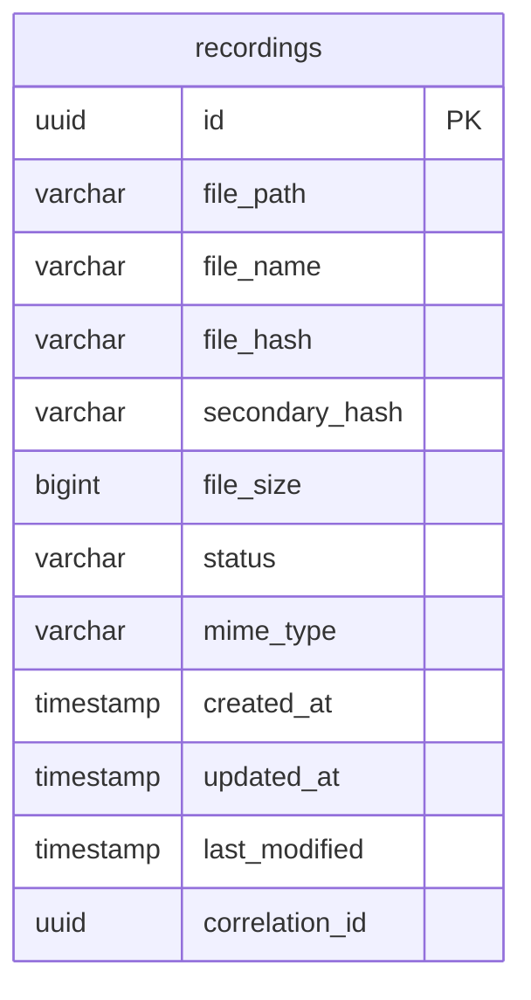
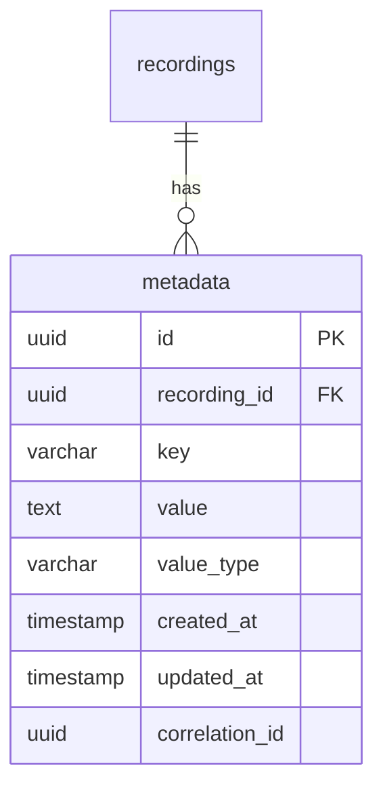
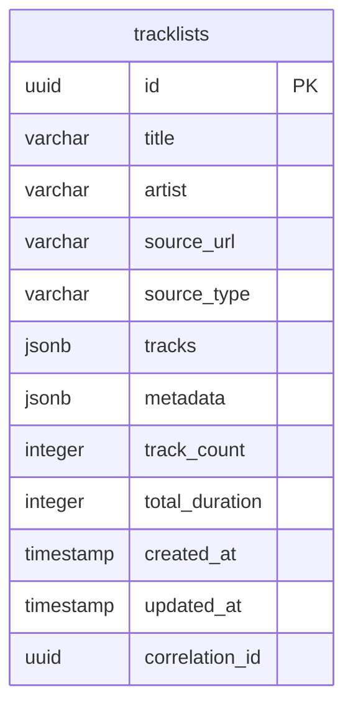
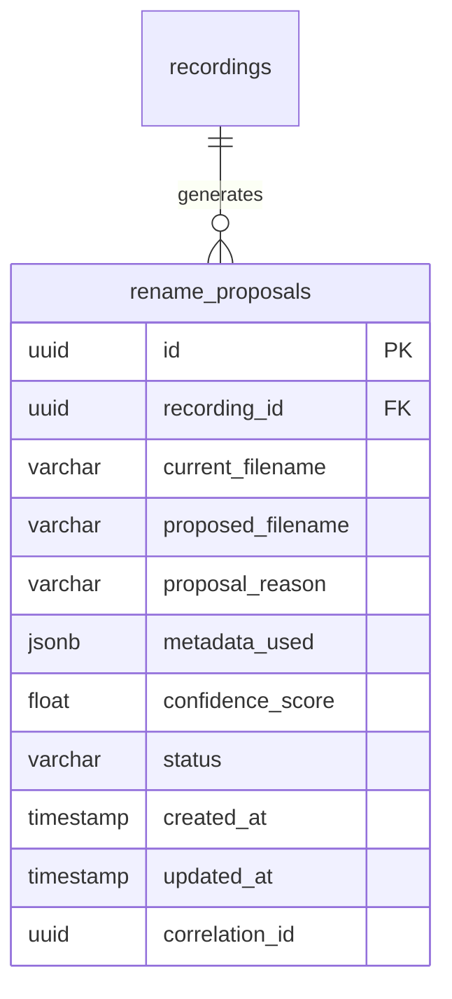
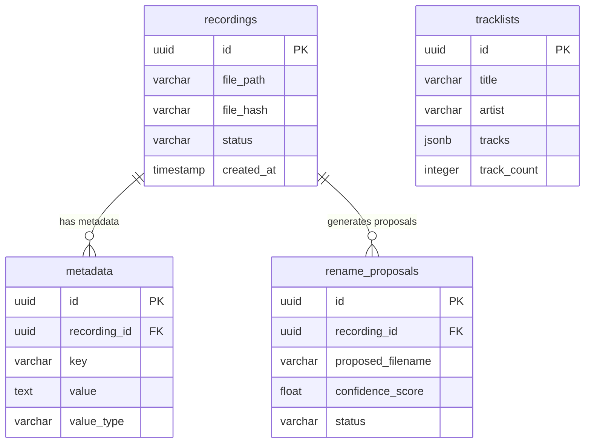
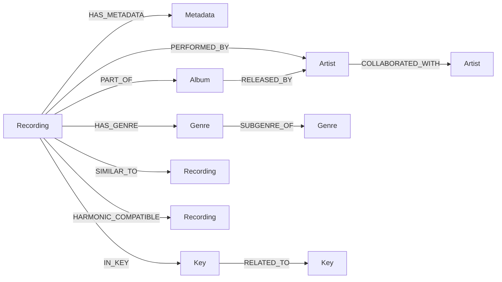
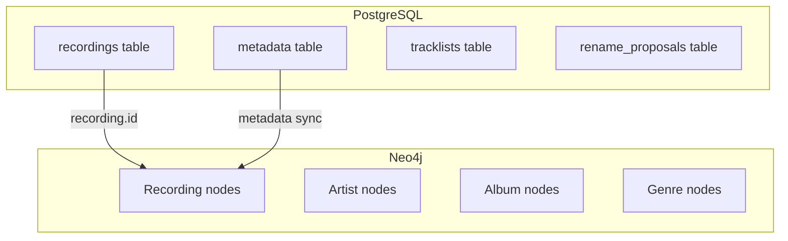

# Database Schema Documentation

Complete database schema documentation for PostgreSQL and Neo4j databases in the Tracktion system.

## Table of Contents

1. [PostgreSQL Schema](#postgresql-schema)
2. [Neo4j Schema](#neo4j-schema)
3. [Schema Relationships](#schema-relationships)
4. [Migration Strategy](#migration-strategy)
5. [Performance Considerations](#performance-considerations)

## PostgreSQL Schema

### Core Tables

#### recordings
Primary table for audio file information.



```sql
CREATE TABLE recordings (
    id UUID PRIMARY KEY DEFAULT gen_random_uuid(),
    file_path VARCHAR(1024) NOT NULL UNIQUE,
    file_name VARCHAR(255) NOT NULL,
    file_hash VARCHAR(64) NOT NULL,
    secondary_hash VARCHAR(32),
    file_size BIGINT,
    status VARCHAR(50) DEFAULT 'pending',
    mime_type VARCHAR(100),
    created_at TIMESTAMP WITH TIME ZONE DEFAULT CURRENT_TIMESTAMP,
    updated_at TIMESTAMP WITH TIME ZONE DEFAULT CURRENT_TIMESTAMP,
    last_modified TIMESTAMP WITH TIME ZONE,
    correlation_id UUID
);

-- Indexes for performance
CREATE INDEX idx_recordings_file_path ON recordings(file_path);
CREATE INDEX idx_recordings_file_hash ON recordings(file_hash);
CREATE INDEX idx_recordings_status ON recordings(status);
CREATE INDEX idx_recordings_created_at ON recordings(created_at);
CREATE UNIQUE INDEX idx_recordings_file_hash_unique ON recordings(file_hash);
```

#### metadata
Key-value pairs for audio metadata.



```sql
CREATE TABLE metadata (
    id UUID PRIMARY KEY DEFAULT gen_random_uuid(),
    recording_id UUID NOT NULL,
    key VARCHAR(100) NOT NULL,
    value TEXT,
    value_type VARCHAR(50) DEFAULT 'string',
    created_at TIMESTAMP WITH TIME ZONE DEFAULT CURRENT_TIMESTAMP,
    updated_at TIMESTAMP WITH TIME ZONE DEFAULT CURRENT_TIMESTAMP,
    correlation_id UUID,
    FOREIGN KEY (recording_id) REFERENCES recordings(id) ON DELETE CASCADE
);

-- Indexes for fast metadata lookups
CREATE INDEX idx_metadata_recording_id ON metadata(recording_id);
CREATE INDEX idx_metadata_key ON metadata(key);
CREATE INDEX idx_metadata_key_value ON metadata(key, value);
CREATE UNIQUE INDEX idx_metadata_recording_key ON metadata(recording_id, key);
```

#### tracklists
Tracklist information with JSONB data.



```sql
CREATE TABLE tracklists (
    id UUID PRIMARY KEY DEFAULT gen_random_uuid(),
    title VARCHAR(500) NOT NULL,
    artist VARCHAR(255),
    source_url VARCHAR(1024),
    source_type VARCHAR(100),
    tracks JSONB NOT NULL DEFAULT '[]',
    metadata JSONB DEFAULT '{}',
    track_count INTEGER DEFAULT 0,
    total_duration INTEGER, -- in seconds
    created_at TIMESTAMP WITH TIME ZONE DEFAULT CURRENT_TIMESTAMP,
    updated_at TIMESTAMP WITH TIME ZONE DEFAULT CURRENT_TIMESTAMP,
    correlation_id UUID
);

-- JSONB indexes for fast track searches
CREATE INDEX idx_tracklists_tracks_gin ON tracklists USING gin (tracks);
CREATE INDEX idx_tracklists_metadata_gin ON tracklists USING gin (metadata);
CREATE INDEX idx_tracklists_title ON tracklists(title);
CREATE INDEX idx_tracklists_artist ON tracklists(artist);
CREATE INDEX idx_tracklists_source_type ON tracklists(source_type);
```

#### rename_proposals
File rename suggestions based on metadata.



```sql
CREATE TABLE rename_proposals (
    id UUID PRIMARY KEY DEFAULT gen_random_uuid(),
    recording_id UUID NOT NULL,
    current_filename VARCHAR(255) NOT NULL,
    proposed_filename VARCHAR(255) NOT NULL,
    proposal_reason TEXT,
    metadata_used JSONB DEFAULT '{}',
    confidence_score FLOAT DEFAULT 0.0,
    status VARCHAR(50) DEFAULT 'pending',
    created_at TIMESTAMP WITH TIME ZONE DEFAULT CURRENT_TIMESTAMP,
    updated_at TIMESTAMP WITH TIME ZONE DEFAULT CURRENT_TIMESTAMP,
    correlation_id UUID,
    FOREIGN KEY (recording_id) REFERENCES recordings(id) ON DELETE CASCADE
);

-- Indexes for proposal management
CREATE INDEX idx_rename_proposals_recording_id ON rename_proposals(recording_id);
CREATE INDEX idx_rename_proposals_status ON rename_proposals(status);
CREATE INDEX idx_rename_proposals_confidence ON rename_proposals(confidence_score);
```

### Relationships Diagram



## Neo4j Schema

### Node Types

#### Recording
Represents audio files in the graph.

```cypher
CREATE (:Recording {
  id: "uuid",
  file_path: "string",
  file_name: "string",
  file_hash: "string",
  created_at: datetime(),
  updated_at: datetime()
})
```

#### Artist
Represents musical artists.

```cypher
CREATE (:Artist {
  name: "string",
  normalized_name: "string",
  aliases: ["string"],
  created_at: datetime()
})
```

#### Album
Represents music albums.

```cypher
CREATE (:Album {
  title: "string",
  normalized_title: "string",
  release_date: date(),
  created_at: datetime()
})
```

#### Genre
Represents musical genres.

```cypher
CREATE (:Genre {
  name: "string",
  parent_genre: "string",
  confidence: 0.0,
  created_at: datetime()
})
```

#### Metadata
Represents metadata key-value pairs.

```cypher
CREATE (:Metadata {
  key: "string",
  value: "string",
  value_type: "string",
  confidence: 0.0,
  created_at: datetime()
})
```

#### Key (Musical Key)
Represents musical keys.

```cypher
CREATE (:Key {
  key: "string",
  scale: "string",
  confidence: 0.0,
  created_at: datetime()
})
```

### Relationship Types

#### HAS_METADATA
Links recordings to their metadata.

```cypher
(:Recording)-[:HAS_METADATA {
  extraction_method: "string",
  confidence: 0.0,
  created_at: datetime()
}]->(:Metadata)
```

#### PERFORMED_BY
Links recordings to artists.

```cypher
(:Recording)-[:PERFORMED_BY {
  role: "string", // "primary", "featured", "composer"
  confidence: 0.0,
  created_at: datetime()
}]->(:Artist)
```

#### PART_OF
Links recordings to albums.

```cypher
(:Recording)-[:PART_OF {
  track_number: 1,
  disc_number: 1,
  confidence: 0.0,
  created_at: datetime()
}]->(:Album)
```

#### HAS_GENRE
Links recordings to genres.

```cypher
(:Recording)-[:HAS_GENRE {
  confidence: 0.0,
  primary: true,
  created_at: datetime()
}]->(:Genre)
```

#### IN_KEY
Links recordings to musical keys.

```cypher
(:Recording)-[:IN_KEY {
  confidence: 0.0,
  detection_method: "string",
  created_at: datetime()
}]->(:Key)
```

#### SIMILAR_TO
Links similar recordings.

```cypher
(:Recording)-[:SIMILAR_TO {
  similarity_score: 0.0,
  similarity_type: "string", // "bpm", "key", "genre", "acoustic"
  created_at: datetime()
}]->(:Recording)
```

#### HARMONIC_COMPATIBLE
Links recordings with harmonic compatibility.

```cypher
(:Recording)-[:HARMONIC_COMPATIBLE {
  compatibility_score: 0.0,
  mixing_recommendation: "string",
  created_at: datetime()
}]->(:Recording)
```

### Neo4j Schema Diagram



### Constraints and Indexes

```cypher
-- Node constraints
CREATE CONSTRAINT recording_id IF NOT EXISTS FOR (r:Recording) REQUIRE r.id IS UNIQUE;
CREATE CONSTRAINT artist_name IF NOT EXISTS FOR (a:Artist) REQUIRE a.name IS UNIQUE;
CREATE CONSTRAINT album_composite IF NOT EXISTS FOR (al:Album) REQUIRE (al.title, al.artist) IS UNIQUE;
CREATE CONSTRAINT genre_name IF NOT EXISTS FOR (g:Genre) REQUIRE g.name IS UNIQUE;
CREATE CONSTRAINT key_composite IF NOT EXISTS FOR (k:Key) REQUIRE (k.key, k.scale) IS UNIQUE;

-- Performance indexes
CREATE INDEX recording_file_path IF NOT EXISTS FOR (r:Recording) ON (r.file_path);
CREATE INDEX recording_hash IF NOT EXISTS FOR (r:Recording) ON (r.file_hash);
CREATE INDEX metadata_key IF NOT EXISTS FOR (m:Metadata) ON (m.key);
CREATE INDEX metadata_value IF NOT EXISTS FOR (m:Metadata) ON (m.value);
CREATE INDEX artist_normalized IF NOT EXISTS FOR (a:Artist) ON (a.normalized_name);
CREATE INDEX album_title IF NOT EXISTS FOR (al:Album) ON (al.normalized_title);
CREATE INDEX genre_name_idx IF NOT EXISTS FOR (g:Genre) ON (g.name);

-- Relationship indexes
CREATE INDEX rel_has_metadata_confidence IF NOT EXISTS FOR ()-[r:HAS_METADATA]-() ON (r.confidence);
CREATE INDEX rel_performed_by_role IF NOT EXISTS FOR ()-[r:PERFORMED_BY]-() ON (r.role);
CREATE INDEX rel_similar_to_score IF NOT EXISTS FOR ()-[r:SIMILAR_TO]-() ON (r.similarity_score);
CREATE INDEX rel_harmonic_compatible_score IF NOT EXISTS FOR ()-[r:HARMONIC_COMPATIBLE]-() ON (r.compatibility_score);
```

## Schema Relationships

### Cross-Database Relationships

The PostgreSQL and Neo4j databases are synchronized via the recording ID:



### Data Synchronization

```python
# Example synchronization between databases
async def sync_recording_to_neo4j(recording_id: UUID, metadata: Dict[str, str]):
    """Sync PostgreSQL recording data to Neo4j graph."""

    # Create or update Recording node
    cypher_query = """
    MERGE (r:Recording {id: $recording_id})
    SET r.file_path = $file_path,
        r.file_name = $file_name,
        r.updated_at = datetime()

    // Create metadata nodes and relationships
    WITH r
    UNWIND $metadata_items AS item
    MERGE (m:Metadata {key: item.key, value: item.value})
    MERGE (r)-[rel:HAS_METADATA]->(m)
    SET rel.created_at = CASE WHEN rel.created_at IS NULL THEN datetime() ELSE rel.created_at END
    """

    # Execute query with parameters
    await neo4j_session.run(cypher_query, {
        'recording_id': str(recording_id),
        'file_path': recording.file_path,
        'file_name': recording.file_name,
        'metadata_items': [{'key': k, 'value': v} for k, v in metadata.items()]
    })
```

## Migration Strategy

### Alembic Migrations (PostgreSQL)

```python
# Example migration file
"""Add confidence scores to rename proposals

Revision ID: 001_add_confidence_scores
Revises: 000_initial_schema
Create Date: 2024-01-01 10:00:00.000000

"""
from alembic import op
import sqlalchemy as sa

# revision identifiers
revision = '001_add_confidence_scores'
down_revision = '000_initial_schema'
branch_labels = None
depends_on = None

def upgrade():
    # Add confidence_score column to rename_proposals
    op.add_column('rename_proposals',
        sa.Column('confidence_score', sa.Float(), nullable=True, default=0.0))

    # Create index on confidence_score
    op.create_index('idx_rename_proposals_confidence', 'rename_proposals', ['confidence_score'])

def downgrade():
    # Remove index and column
    op.drop_index('idx_rename_proposals_confidence')
    op.drop_column('rename_proposals', 'confidence_score')
```

### Neo4j Schema Evolution

```cypher
-- Migration script for Neo4j schema changes
// Add new relationship type for tempo compatibility
MATCH (r1:Recording), (r2:Recording)
WHERE r1.bpm IS NOT NULL AND r2.bpm IS NOT NULL
  AND abs(toFloat(r1.bpm) - toFloat(r2.bmp)) <= 5
CREATE (r1)-[:TEMPO_COMPATIBLE {
  bpm_difference: abs(toFloat(r1.bpm) - toFloat(r2.bpm)),
  created_at: datetime()
}]->(r2)
```

### Data Migration Scripts

```python
# scripts/migrate_legacy_data.py
async def migrate_legacy_recordings():
    """Migrate legacy recording data to new schema."""

    # Step 1: Migrate PostgreSQL data
    legacy_recordings = await db.fetch_all(
        "SELECT * FROM legacy_recordings WHERE migrated = false"
    )

    for record in legacy_recordings:
        # Transform data to new format
        new_recording = {
            'id': record['old_id'],
            'file_path': record['path'],
            'file_hash': calculate_hash(record['path']),
            'created_at': record['created_date']
        }

        # Insert into new table
        await db.execute(
            "INSERT INTO recordings (id, file_path, file_hash, created_at) VALUES ($1, $2, $3, $4)",
            new_recording['id'], new_recording['file_path'],
            new_recording['file_hash'], new_recording['created_at']
        )

        # Mark as migrated
        await db.execute(
            "UPDATE legacy_recordings SET migrated = true WHERE old_id = $1",
            record['old_id']
        )

    # Step 2: Migrate Neo4j data
    for record in legacy_recordings:
        await neo4j_session.run("""
            CREATE (:Recording {
                id: $id,
                file_path: $file_path,
                migrated_at: datetime()
            })
        """, {
            'id': str(record['old_id']),
            'file_path': record['path']
        })
```

## Performance Considerations

### PostgreSQL Optimization

```sql
-- Partitioning large tables by date
CREATE TABLE recordings_2024 PARTITION OF recordings
FOR VALUES FROM ('2024-01-01') TO ('2025-01-01');

-- Materialized views for complex queries
CREATE MATERIALIZED VIEW recording_stats AS
SELECT
    DATE_TRUNC('month', created_at) as month,
    status,
    COUNT(*) as count,
    AVG(file_size) as avg_file_size
FROM recordings
GROUP BY DATE_TRUNC('month', created_at), status;

-- Refresh materialized view
CREATE OR REPLACE FUNCTION refresh_recording_stats()
RETURNS void AS $$
BEGIN
    REFRESH MATERIALIZED VIEW CONCURRENTLY recording_stats;
END;
$$ LANGUAGE plpgsql;

-- Scheduled refresh
SELECT cron.schedule('refresh-recording-stats', '0 1 * * *', 'SELECT refresh_recording_stats();');
```

### Neo4j Performance

```cypher
// Periodic cleanup of low-confidence relationships
MATCH ()-[r:SIMILAR_TO|HARMONIC_COMPATIBLE]-()
WHERE r.confidence < 0.3
DELETE r;

// Update similarity scores based on new data
MATCH (r1:Recording)-[s:SIMILAR_TO]-(r2:Recording)
SET s.last_calculated = datetime(),
    s.confidence = CASE
        WHEN s.confidence > 0.8 THEN s.confidence * 1.1
        ELSE s.confidence * 0.9
    END;

// Optimize frequent queries with periodic statistics
CALL db.stats.retrieve('NODES');
CALL db.stats.retrieve('RELATIONSHIPS');
```

### Monitoring Queries

```sql
-- PostgreSQL monitoring
-- Long running queries
SELECT
    pid,
    now() - pg_stat_activity.query_start AS duration,
    query
FROM pg_stat_activity
WHERE (now() - pg_stat_activity.query_start) > interval '5 minutes';

-- Index usage statistics
SELECT
    indexrelname,
    idx_tup_read,
    idx_tup_fetch,
    idx_scan
FROM pg_stat_user_indexes
WHERE schemaname = 'public'
ORDER BY idx_scan DESC;
```

```cypher
// Neo4j monitoring
// Show slow queries
CALL dbms.queryJournal.show("slow");

// Memory usage
CALL dbms.memory.tracking.components();

// Database statistics
CALL db.stats.retrieve("GRAPH COUNTS");
```

This comprehensive database schema documentation provides all the information needed to understand, maintain, and optimize the Tracktion database layer.
