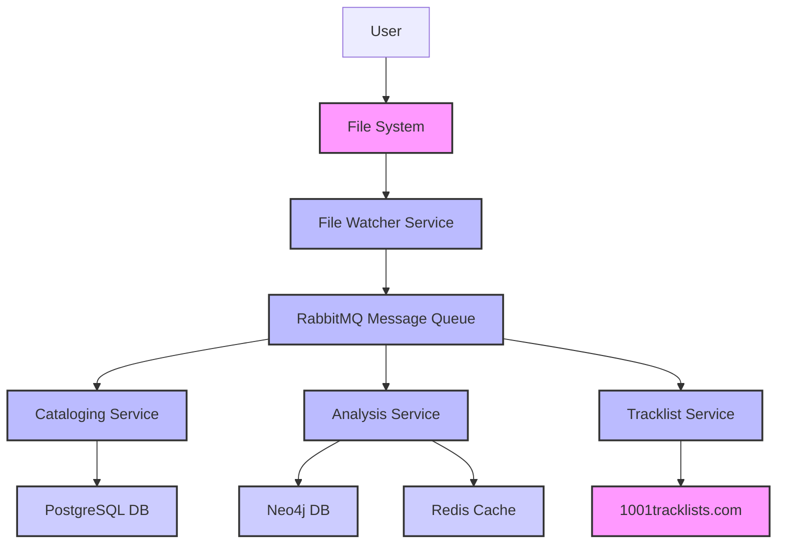

# High Level Architecture

This section lays the foundation of the project's technical architecture. I will now present a draft of the key architectural components, patterns, and a high-level overview. Please review this holistic view of the system's design.

### **Technical Summary**

The **tracktion** system will utilize a decoupled, microservices-based architecture built with Python 3.12+. Services will communicate asynchronously via a RabbitMQ message queue, enabling a scalable and resilient system. A file watcher will act as the entry point, triggering a chain of events that lead to the cataloging and enrichment of music files. Data will be stored across a polyglot persistence layer consisting of PostgreSQL for core relational data and Neo4j for graph-based analysis, with Redis providing caching capabilities. This design supports the primary goal of automated and extensible music library management.

### **High Level Overview**

Based on the project's requirements for a scalable, decoupled system, we will adopt a **microservices architecture**. This approach allows for independent development and scaling of each service (e.g., the File Watcher, Cataloging Service, Analysis Service). The system will be deployed within a **monorepo** to streamline development and dependency management. The primary data flow will be event-driven: a file event triggers a message on the queue, which is then consumed by the appropriate services.

### **High Level Project Diagram**

### **Architectural and Design Patterns**

  * [cite\_start]**Microservices Architecture:** Decomposing the application into small, loosely-coupled services[cite: 2629]. - *Rationale:* This aligns with the need for scalability and asynchronous processing, as specified in the PRD, and makes the system easier to manage and extend.
  * **Event-Driven Communication:** Services communicate by publishing and subscribing to messages via RabbitMQ. - *Rationale:* This decouples the services, ensuring that a failure in one service does not halt the entire system. It is a highly scalable pattern that fits the file-watcher and processing pipeline model.
  * **Repository Pattern:** Abstracting data access logic behind a clean interface. - *Rationale:* This allows for the independent development and testing of service logic without direct dependencies on the underlying datastores. It also simplifies future migrations or changes to the database.
  * **Polyglot Persistence:** Using multiple datastores, each optimized for a specific data type. - *Rationale:* This is a necessity given the project's requirements for both relational (PostgreSQL) and graph (Neo4j) data. It allows us to leverage the strengths of each technology.
