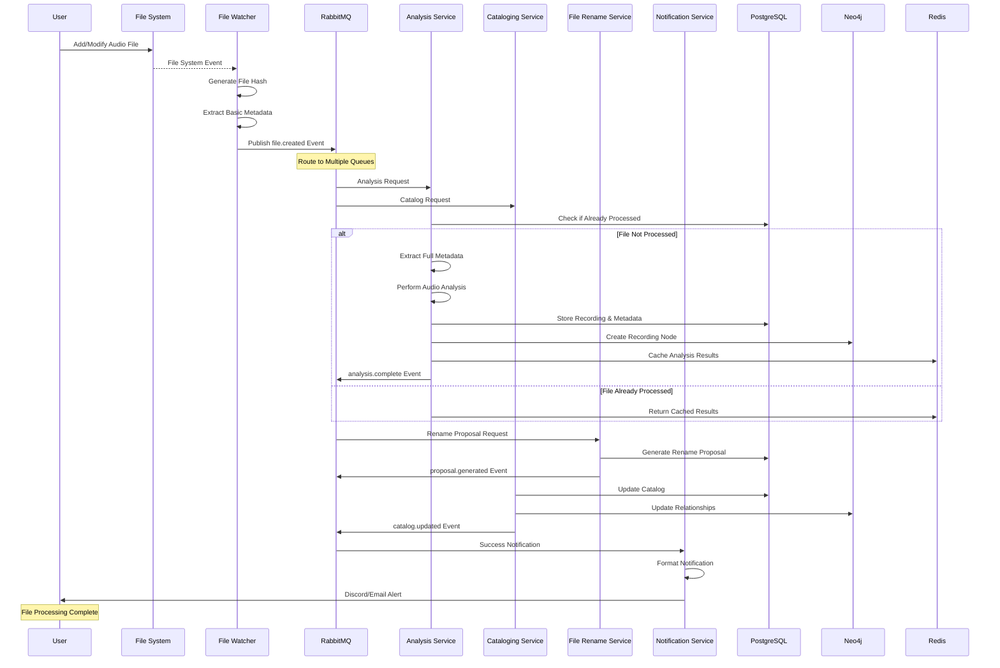
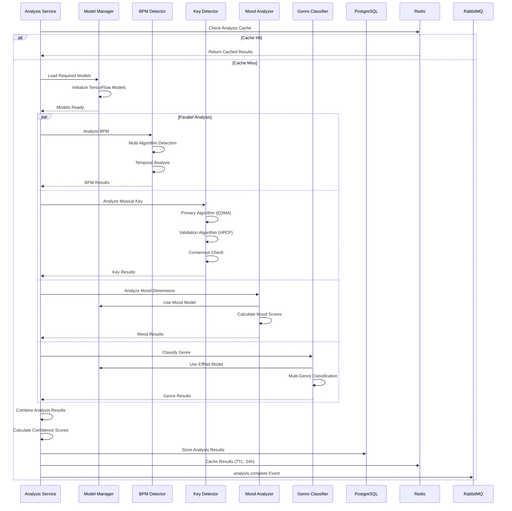
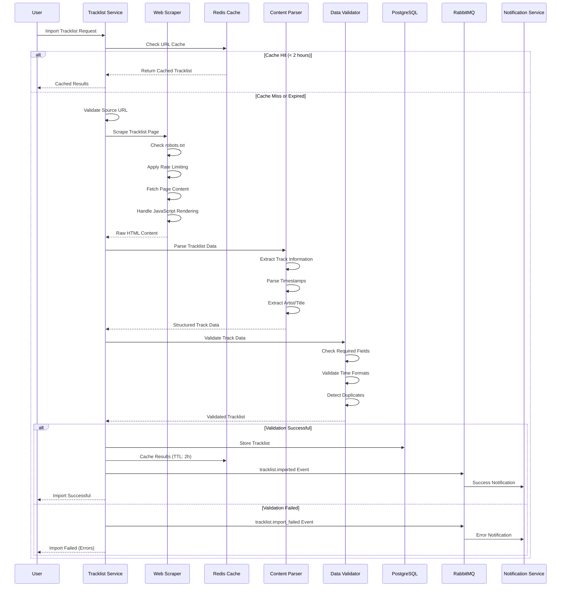
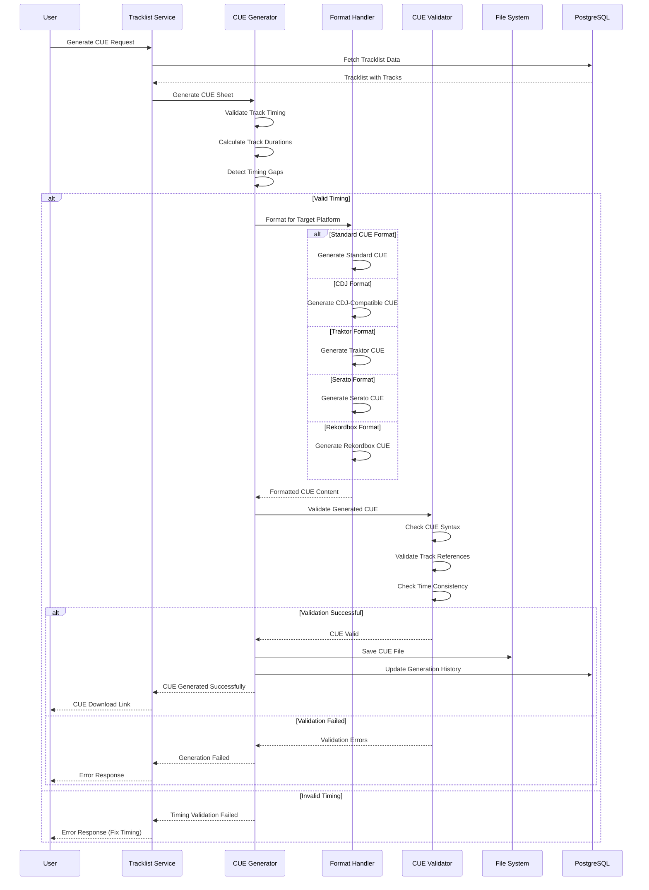
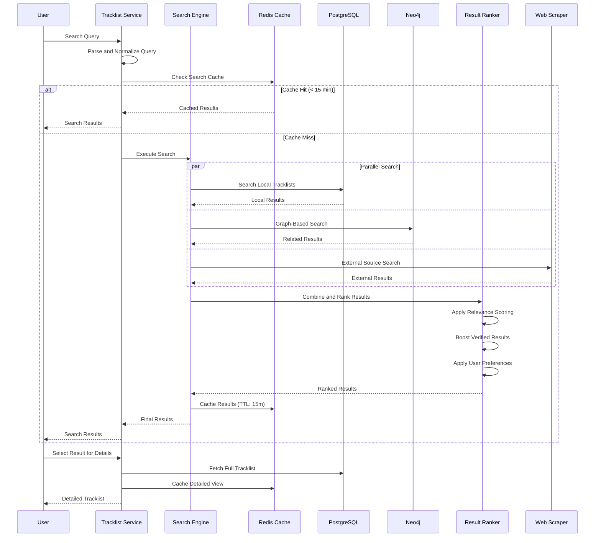
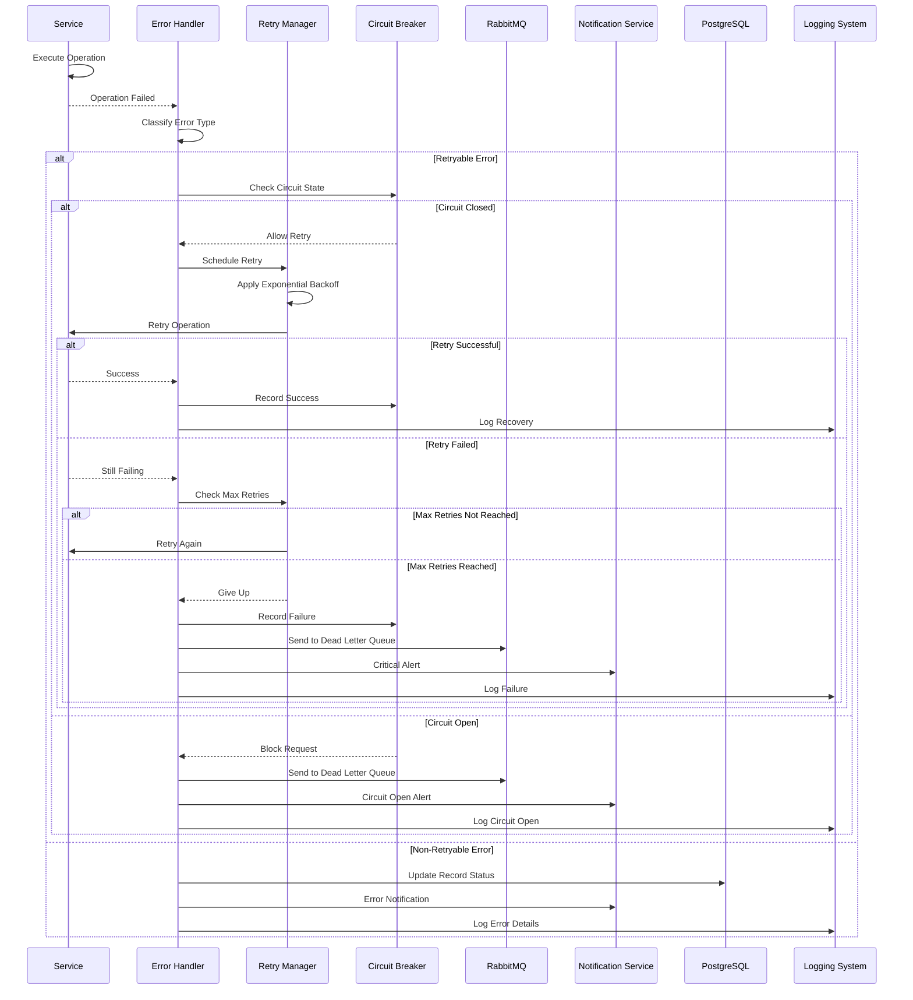
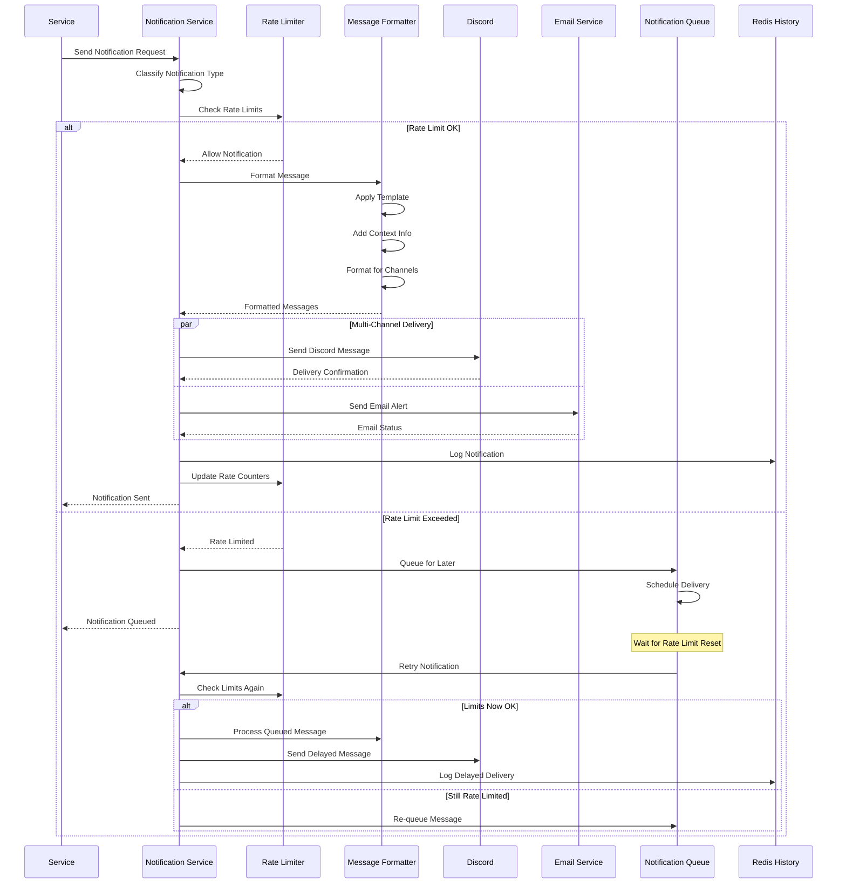
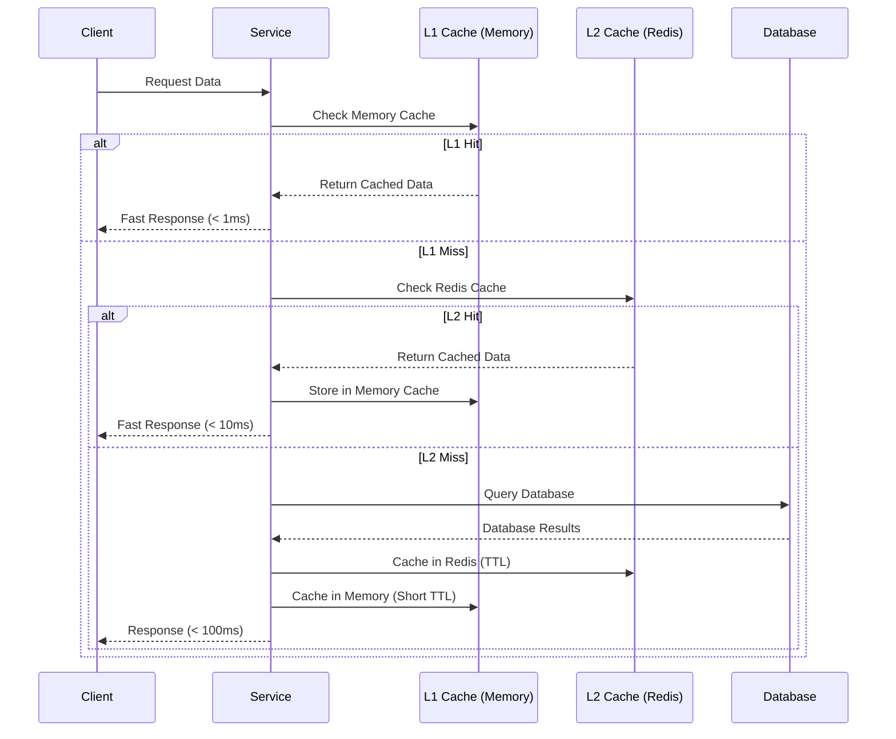
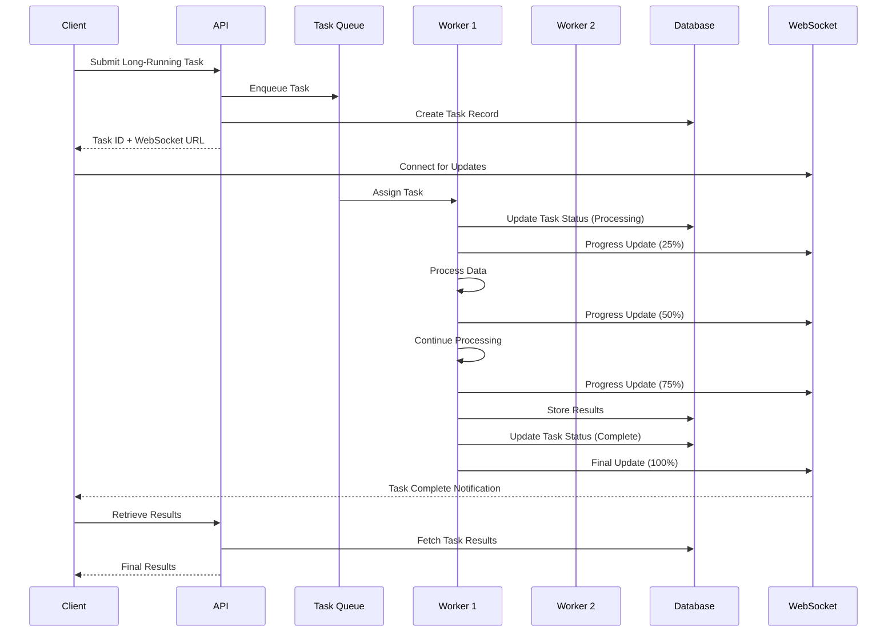

# Sequence Diagrams for Key Workflows

This document provides detailed sequence diagrams for critical workflows in the Tracktion system.

## Table of Contents

1. [File Processing Workflow](#file-processing-workflow)
2. [Audio Analysis Workflow](#audio-analysis-workflow)
3. [Tracklist Import Workflow](#tracklist-import-workflow)
4. [CUE Generation Workflow](#cue-generation-workflow)
5. [Search and Discovery Workflow](#search-and-discovery-workflow)
6. [Error Handling Workflow](#error-handling-workflow)
7. [Notification Workflow](#notification-workflow)

## File Processing Workflow

Complete workflow from file detection to catalog completion.

## Audio Analysis Workflow

Detailed audio analysis process with multiple algorithms.

## Tracklist Import Workflow

Web scraping and tracklist import process.

## CUE Generation Workflow

CUE sheet generation with format support.

## Search and Discovery Workflow

Advanced search with caching and ranking.

## Error Handling Workflow

Comprehensive error handling and retry logic.

## Notification Workflow

Multi-channel notification system with rate limiting.

## Performance Optimization Workflows

### Caching Strategy

### Background Processing

These sequence diagrams provide detailed views of the most critical workflows in the Tracktion system, showing the interactions between services, error handling, performance optimizations, and user experience flows.
