# Service Interaction Diagrams

This document provides visual representations of how the different services in the Tracktion ecosystem interact with each other.

## High-Level System Architecture

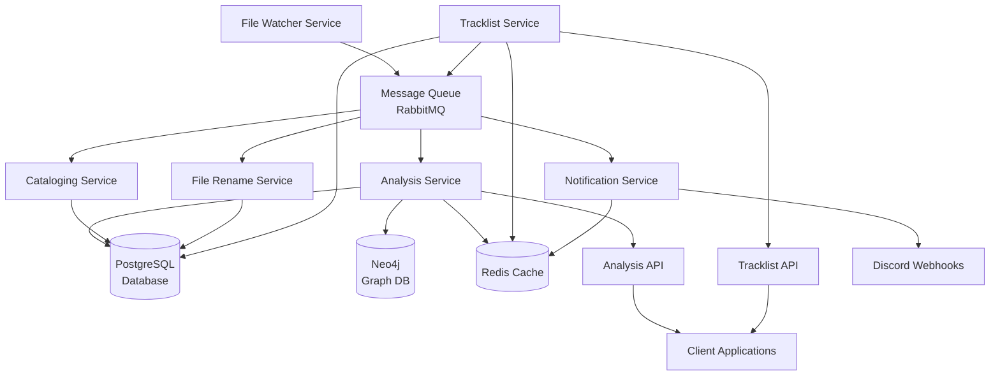

## Message Flow Architecture

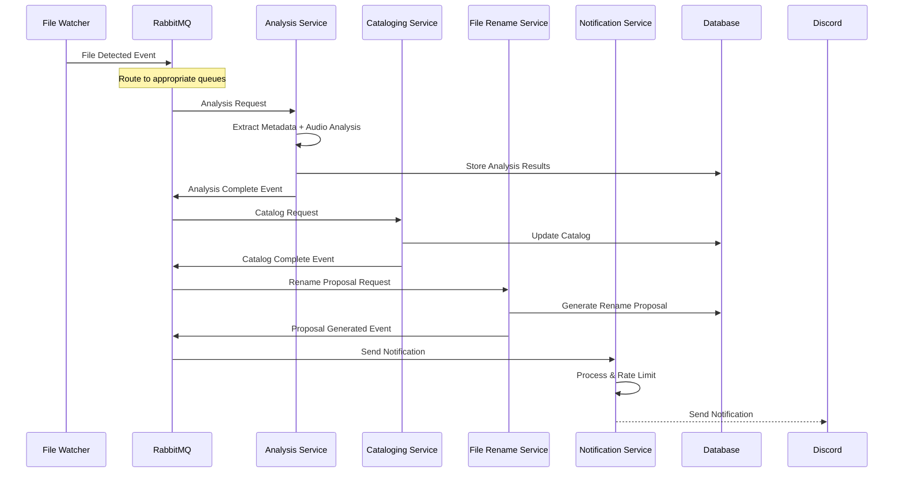

## Service Dependencies

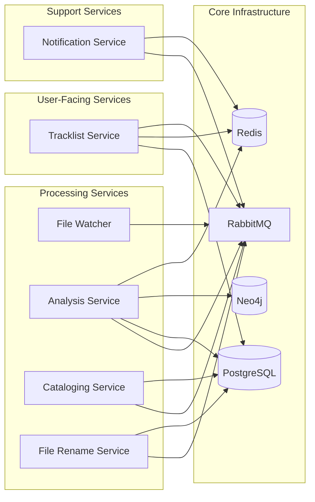

## Data Flow Diagram

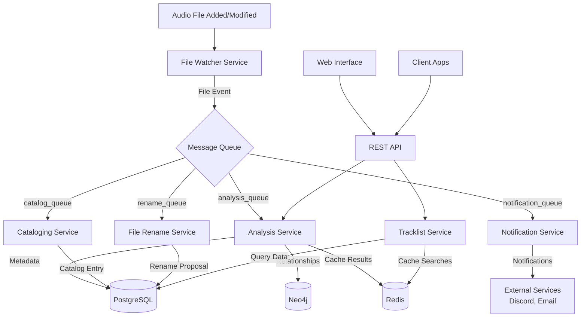

## Service Communication Patterns

### 1. Event-Driven Architecture
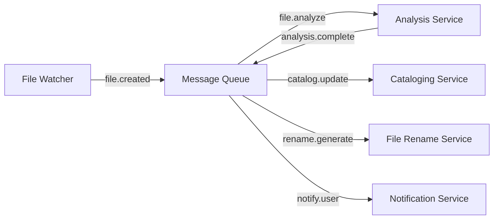

### 2. Request-Response Pattern
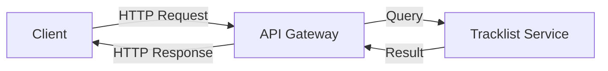

### 3. Background Processing
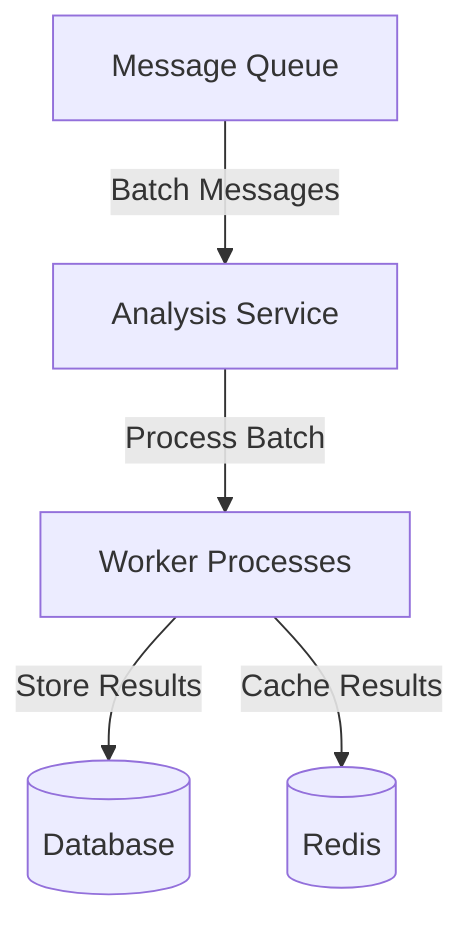

## Integration Points

### Analysis Service Integration
- **Input**: File metadata from File Watcher
- **Processing**: BPM detection, key analysis, mood analysis
- **Output**: Analysis results to database, completion events to queue
- **APIs**: REST API for querying analysis results

### Tracklist Service Integration
- **Input**: User search requests, catalog data
- **Processing**: Web scraping, search indexing, CUE generation
- **Output**: Search results, tracklist data, CUE files
- **APIs**: REST API for search and tracklist operations

### File Watcher Integration
- **Input**: File system events
- **Processing**: File monitoring, metadata extraction, hash generation
- **Output**: File events to message queue
- **APIs**: None (internal service)

### Cataloging Service Integration
- **Input**: File and analysis events from queue
- **Processing**: Catalog organization, metadata consolidation
- **Output**: Updated catalog in database
- **APIs**: Internal database queries

### File Rename Service Integration
- **Input**: Analysis completion events
- **Processing**: Generate rename proposals based on metadata
- **Output**: Rename proposals in database
- **APIs**: Proposal management endpoints

### Notification Service Integration
- **Input**: Events from all services via queue
- **Processing**: Rate limiting, formatting, delivery
- **Output**: Notifications to external services (Discord, email)
- **APIs**: Admin endpoints for notification management

## Error Handling & Circuit Breakers

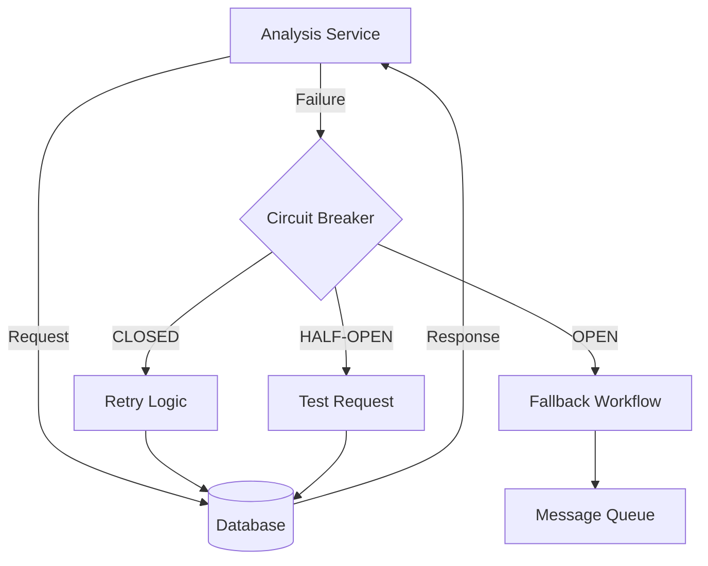

## Monitoring & Health Checks

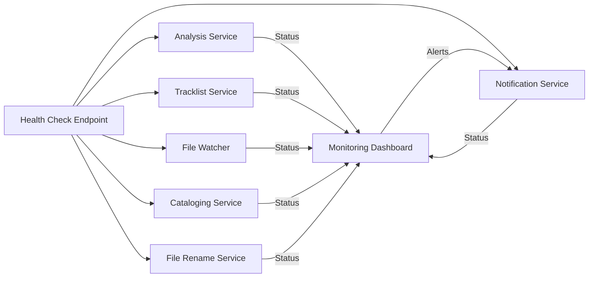

## Deployment Architecture

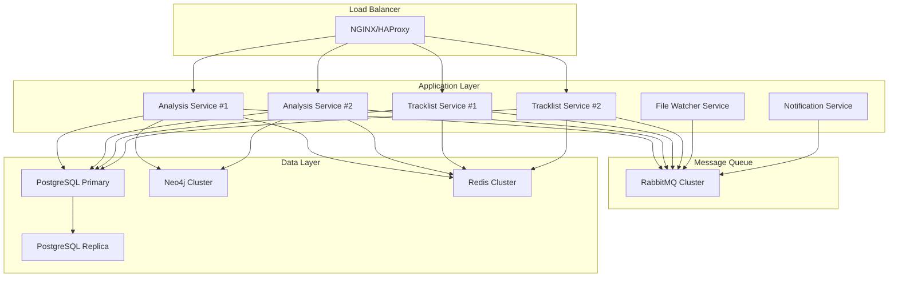

## Message Queue Topics & Routing

### Exchange Configuration
- **Main Exchange**: `tracktion_exchange` (topic)
- **Dead Letter Exchange**: `tracktion_dlx` (direct)

### Routing Keys
```
file.created        -> analysis_queue, catalog_queue
file.modified       -> analysis_queue, catalog_queue
file.deleted        -> catalog_queue, cleanup_queue
analysis.complete   -> catalog_queue, rename_queue, notification_queue
catalog.updated     -> notification_queue
rename.generated    -> notification_queue
error.*            -> notification_queue, dlq_queue
```

### Queue Configuration
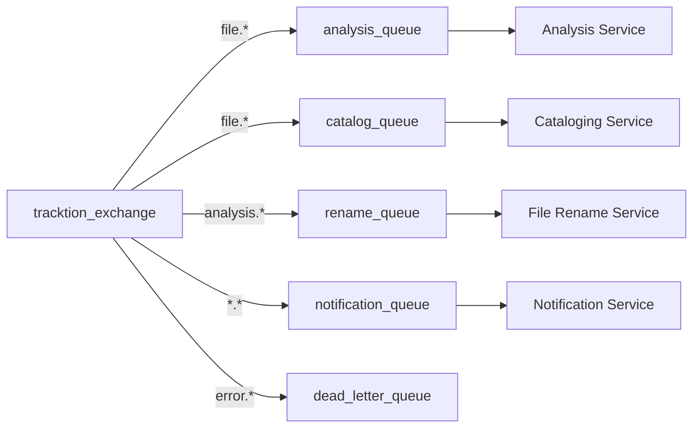

## Security Architecture

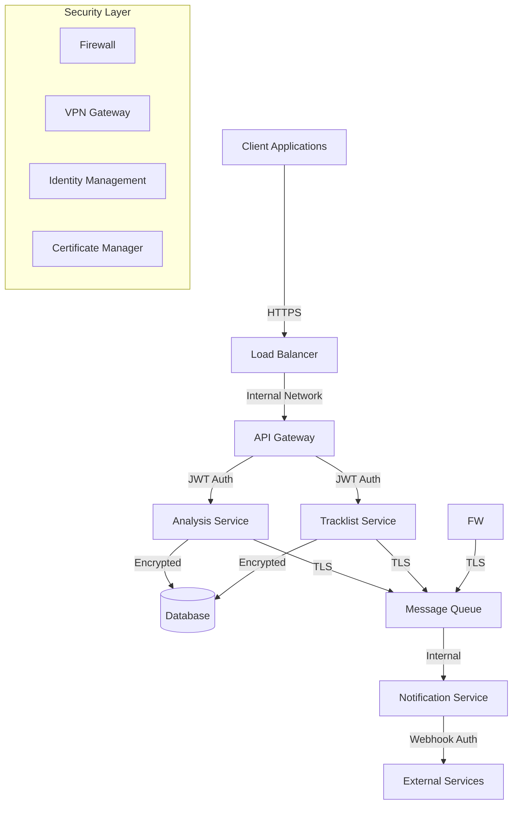

This comprehensive set of diagrams shows how all services in the Tracktion ecosystem interact, communicate, and depend on each other for a cohesive music analysis and management system.
