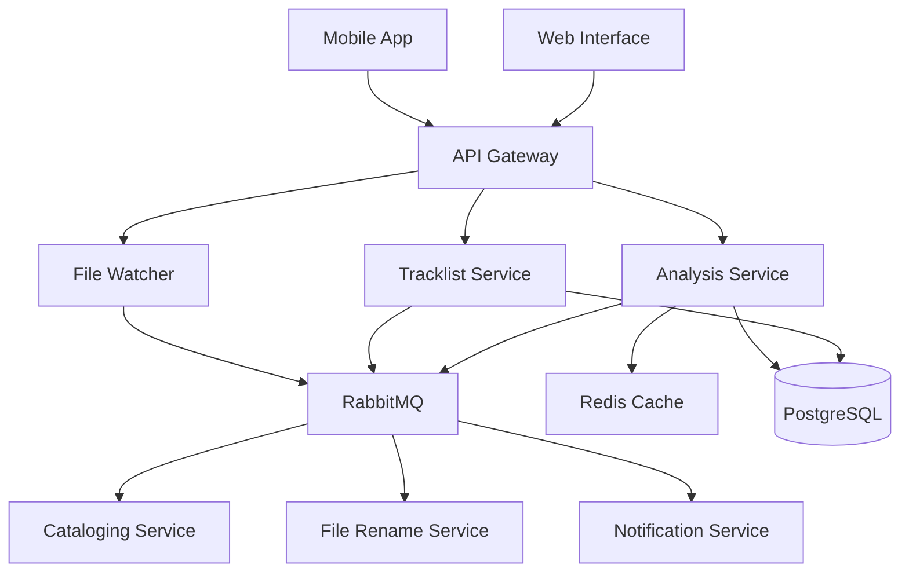

# Tracktion Documentation

Welcome to the comprehensive documentation for **Tracktion**, an automated music library management system built with modern microservices architecture.

## What is Tracktion?

Tracktion is an intelligent music management system that automatically analyzes, organizes, and manages your music collection. Using advanced audio processing algorithms and machine learning, it provides:

- **Automated Audio Analysis**: BPM detection, key detection, and mood analysis
- **Intelligent Organization**: Smart file organization and metadata management
- **Playlist Management**: Advanced playlist creation and track matching
- **Real-time Processing**: File system monitoring and automatic processing
- **Scalable Architecture**: Microservices-based design for high availability

## Quick Navigation

<div class="grid cards" markdown>

-   :material-rocket-launch: **Getting Started**

    ---

    New to Tracktion? Start here for installation, setup, and your first steps.

    [Get Started →](getting-started/index.md)

-   :material-cog: **Setup & Configuration**

    ---

    System requirements, installation guides, and configuration options.

    [Setup Guide →](setup/index.md)

-   :material-code-braces: **Development**

    ---

    Development environment, coding standards, and contribution guidelines.

    [Developer Guide →](development/index.md)

-   :material-api: **API Reference**

    ---

    Complete API documentation with examples and authentication guides.

    [API Docs →](api/index.md)

-   :material-monitor: **Operations**

    ---

    Deployment, monitoring, troubleshooting, and production operations.

    [Operations →](operations/index.md)

-   :material-school: **Tutorials**

    ---

    Step-by-step tutorials and examples for common use cases.

    [Learn More →](tutorials/index.md)

</div>

## System Architecture

Tracktion follows a **microservices architecture** with the following core components:



### Core Services

| Service | Purpose | Technology |
|---------|---------|------------|
| **Analysis Service** | Audio analysis (BPM, key, mood) | Python, Essentia, TensorFlow |
| **Tracklist Service** | Playlist and track management | Python, FastAPI, SQLAlchemy |
| **File Watcher** | File system monitoring | Python, Watchdog |
| **Cataloging Service** | Music library management | Python, Neo4j |
| **File Rename Service** | Intelligent file organization | Python |
| **Notification Service** | User notifications | Python |

## Key Features

### 🎵 Audio Analysis
- **BPM Detection**: Multi-algorithm tempo detection with confidence scoring
- **Key Detection**: Musical key and scale identification using HPCP analysis
- **Mood Analysis**: Genre classification and emotional content analysis
- **Quality Assessment**: Audio quality metrics and validation

### 📂 File Management
- **Smart Organization**: Automatic file naming and directory structure
- **Duplicate Detection**: Identify and handle duplicate tracks
- **Format Support**: MP3, FLAC, WAV, M4A, AAC, OGG
- **Metadata Extraction**: Comprehensive ID3 tag processing

### 🎼 Playlist Features
- **Intelligent Matching**: Fuzzy search and similarity algorithms
- **Auto-Generation**: Mood-based and tempo-based playlist creation
- **Collaboration**: Shared playlists and user permissions
- **Export Options**: Multiple format support for playlist export

### 🔧 Developer Experience
- **Modern Stack**: Python 3.11+, FastAPI, Docker, Kubernetes
- **Comprehensive APIs**: RESTful APIs with OpenAPI documentation
- **Real-time Updates**: WebSocket support for live updates
- **Testing Suite**: Unit, integration, and end-to-end testing

## Quick Start

Get Tracktion running in 5 minutes:

```bash
# Clone the repository
git clone https://github.com/your-org/tracktion.git
cd tracktion

# Install dependencies
uv sync

# Start services
docker-compose up -d

# Run database migrations
uv run alembic upgrade head

# Verify installation
curl http://localhost:8001/health
```

For detailed setup instructions, see the [Installation Guide](setup/installation.md).

## Community and Support

- **GitHub Repository**: [github.com/your-org/tracktion](https://github.com/your-org/tracktion)
- **Issue Tracker**: Report bugs and request features
- **Discussions**: Community support and Q&A
- **Slack Channel**: Real-time community chat

## Documentation Structure

This documentation is organized into several main sections:

### For New Users
- **[Getting Started](getting-started/index.md)**: Quick setup and first steps
- **[Setup & Configuration](setup/index.md)**: Detailed installation and configuration
- **[Tutorials](tutorials/index.md)**: Step-by-step learning guides

### For Developers
- **[Development](development/index.md)**: Development environment and workflows
- **[API Reference](api/index.md)**: Complete API documentation
- **[Architecture](architecture/index.md)**: System design and technical details

### For Operations
- **[Operations](operations/index.md)**: Deployment, monitoring, and troubleshooting
- **[Reference](reference/index.md)**: Configuration options and technical reference

## Latest Updates

!!! tip "Version 1.0 Released!"

    Tracktion 1.0 is now available with improved performance, new analysis algorithms, and enhanced API capabilities.

    [View Changelog →](reference/changelog.md)

## License

Tracktion is released under the [MIT License](https://github.com/your-org/tracktion/blob/main/LICENSE).

---

*This documentation is automatically generated and updated. Last updated: {{ git_revision_date_localized }}*
