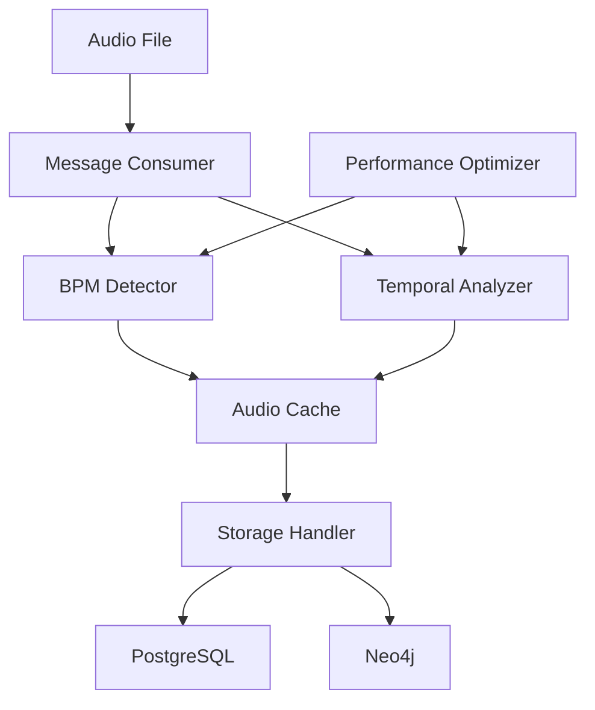

# Story 2.3: BPM Detection Implementation - Documentation

## Overview

This document provides comprehensive documentation for the BPM (Beats Per Minute) detection system implemented in Story 2.3. The system provides accurate tempo detection, temporal analysis, and performance optimization for audio files.

## Architecture Overview



### Core Components

1. **BPM Detector** (`bpm_detector.py`) - Primary tempo detection using Essentia algorithms
2. **Temporal Analyzer** (`temporal_analyzer.py`) - Time-based tempo analysis and stability detection
3. **Audio Cache** (`audio_cache.py`) - Redis-based caching layer for performance optimization
4. **Message Consumer** (`message_consumer.py`) - RabbitMQ integration and workflow orchestration
5. **Storage Handler** (`storage_handler.py`) - Database persistence for PostgreSQL and Neo4j
6. **Performance Optimizer** (`performance.py`) - Memory management and streaming optimization
7. **Configuration Management** (`config.py`) - Environment-based configuration system

## BPM Detection Algorithms

### Primary Algorithm: RhythmExtractor2013
- **Library**: Essentia
- **Method**: Advanced rhythm extraction with confidence scoring
- **Use Case**: General-purpose BPM detection for most audio types
- **Confidence**: Normalized to 0-1 scale
- **Accuracy**: ±5 BPM for clean audio

### Fallback Algorithm: PercivalBpmEstimator
- **Library**: Essentia
- **Method**: Percival's beat tracking algorithm
- **Use Case**: When primary algorithm confidence is low (<0.7)
- **Integration**: Consensus-based result combination
- **Validation**: Agreement tolerance of ±5 BPM

### Algorithm Selection Logic
```python
if primary_confidence < threshold:
    fallback_bpm = percival_estimator(audio)
    if abs(primary_bpm - fallback_bpm) < tolerance:
        # Algorithms agree - boost confidence
        confidence = min(0.9, confidence + 0.3)
        algorithm = "consensus"
    else:
        # Disagreement - use most stable
        algorithm = "fallback" if unstable else "primary"
        needs_review = True
```

## Temporal Analysis

### Window-Based Analysis
- **Window Size**: 10 seconds (configurable)
- **Hop Size**: 5 seconds (50% overlap)
- **Analysis Points**: Multiple windows across track duration
- **Stability Scoring**: Coefficient of variation of BPM measurements

### Tempo Change Detection
```python
# Detect significant tempo changes
for i in range(1, len(bpm_windows)):
    change = abs(bpm_windows[i] - bpm_windows[i-1])
    if change > change_threshold:
        tempo_changes.append({
            'timestamp': windows[i]['start_time'],
            'from_bpm': bpm_windows[i-1],
            'to_bpm': bpm_windows[i],
            'change': change
        })
```

### Stability Metrics
- **Stability Score**: 1.0 - coefficient_of_variation
- **Variable Tempo Threshold**: Stability < 0.8
- **Confidence Adjustment**: Lower confidence for unstable tempos

## Caching Strategy

### Redis Implementation
- **Key Format**: `{prefix}:{file_hash}:{algorithm_version}`
- **Hash Algorithms**: SHA256 (primary), XXHash128 (performance)
- **TTL Management**:
  - Successful results: 30 days
  - Failed results: 1 hour
  - Low confidence: 7 days

### Cache Efficiency
```python
def get_cache_key(self, file_path: str, prefix: str) -> str:
    file_hash = self.get_file_hash(file_path)
    return f"{prefix}:{file_hash}:{self.algorithm_version}"

def cache_bpm_results(self, file_path: str, results: Dict[str, Any]) -> bool:
    cache_key = self.get_cache_key(file_path, "bpm")
    ttl = self.get_ttl_for_result(results)
    return self.redis_client.setex(cache_key, ttl, json.dumps(results))
```

## Configuration Management

### Environment Variables
All configuration uses the `TRACKTION_` prefix:

```bash
# BPM Detection
TRACKTION_BPM_CONFIDENCE_THRESHOLD=0.7
TRACKTION_BPM_AGREEMENT_TOLERANCE=5.0

# Temporal Analysis
TRACKTION_TEMPORAL_WINDOW_SIZE_SECONDS=10.0
TRACKTION_TEMPORAL_STABILITY_THRESHOLD=0.8

# Caching
TRACKTION_CACHE_REDIS_HOST=localhost
TRACKTION_CACHE_REDIS_PORT=6379
TRACKTION_CACHE_DEFAULT_TTL_DAYS=30

# Performance
TRACKTION_PERFORMANCE_PARALLEL_WORKERS=4
TRACKTION_PERFORMANCE_MEMORY_LIMIT_MB=1000
TRACKTION_PERFORMANCE_ENABLE_STREAMING=true
```

### Configuration Classes
```python
@dataclass
class BPMConfig:
    confidence_threshold: float = 0.7
    fallback_threshold: float = 0.5
    agreement_tolerance: float = 5.0
    max_file_size_mb: int = 500
    supported_formats: list = field(default_factory=lambda: [".mp3", ".wav", ".flac"])

@dataclass
class TemporalConfig:
    window_size_seconds: float = 10.0
    start_window_seconds: float = 30.0
    end_window_seconds: float = 30.0
    stability_threshold: float = 0.8
```

## Performance Optimization

### Memory Management
- **Streaming Threshold**: Files >50MB automatically streamed
- **Memory Limits**: Configurable per-process memory limits
- **Garbage Collection**: Automatic cleanup after processing
- **Resource Monitoring**: Real-time memory and CPU tracking

### Parallel Processing
```python
# Batch processing with configurable workers
def process_files(self, file_paths: List[str], processor: Callable) -> List[Dict]:
    if self.max_workers <= 1:
        return [processor(fp) for fp in file_paths]

    with ThreadPoolExecutor(max_workers=self.max_workers) as executor:
        futures = {executor.submit(processor, fp): fp for fp in file_paths}
        return [future.result() for future in as_completed(futures)]
```

### Streaming Support
- **Chunk Size**: Configurable chunk processing
- **Memory Efficient**: Process large files without loading entirely
- **Progress Tracking**: Real-time processing progress
- **Error Recovery**: Graceful handling of corrupted chunks

## Database Schema

### PostgreSQL (Metadata Storage)
```sql
-- BPM metadata in existing metadata table
INSERT INTO metadata (recording_id, key, value) VALUES
(?, 'bpm', ?),
(?, 'bpm_confidence', ?),
(?, 'bpm_algorithm', ?),
(?, 'tempo_stability', ?),
(?, 'is_variable_tempo', ?);
```

### Neo4j (Relationship Storage)
```cypher
// BPM range relationships
MATCH (r:Recording {id: $recording_id})
CREATE (r)-[:HAS_BPM_RANGE]->(range:BPMRange {
    name: $range_name,
    min_bpm: $min_bpm,
    max_bpm: $max_bpm
})

// Temporal analysis relationships
CREATE (r)-[:HAS_TEMPORAL_ANALYSIS]->(analysis:TemporalAnalysis {
    start_bpm: $start_bpm,
    end_bpm: $end_bpm,
    stability_score: $stability_score,
    num_tempo_changes: $num_changes
})
```

## API Reference

### BPMDetector Class

#### Methods
```python
def detect_bpm(self, audio_path: str) -> Dict[str, Any]:
    """
    Detect BPM from audio file.

    Returns:
        {
            'bpm': float,
            'confidence': float,
            'beats': List[float],
            'algorithm': str,
            'needs_review': bool
        }
    """

def detect_bpm_with_confidence(self, audio_path: str) -> Dict[str, Any]:
    """Enhanced detection with additional metadata."""
```

### TemporalAnalyzer Class

#### Methods
```python
def analyze_temporal_bpm(self, audio_path: str) -> Dict[str, Any]:
    """
    Perform temporal BPM analysis.

    Returns:
        {
            'average_bpm': float,
            'start_bpm': float,
            'end_bpm': float,
            'stability_score': float,
            'temporal_bpm': List[Dict],
            'tempo_changes': List[Dict],
            'is_variable_tempo': bool
        }
    """
```

### AudioCache Class

#### Methods
```python
def get_bpm_results(self, file_path: str) -> Optional[Dict[str, Any]]:
    """Retrieve cached BPM results."""

def set_bpm_results(self, file_path: str, results: Dict[str, Any]) -> bool:
    """Cache BPM results with appropriate TTL."""

def get_temporal_results(self, file_path: str) -> Optional[Dict[str, Any]]:
    """Retrieve cached temporal analysis results."""
```

## Testing

### Test Categories

#### Unit Tests
- **BPM Detector**: Algorithm accuracy, confidence scoring, error handling
- **Temporal Analyzer**: Window analysis, stability calculations, tempo change detection
- **Audio Cache**: Redis operations, TTL management, hash generation
- **Performance**: Memory monitoring, streaming, parallel processing

#### Integration Tests
- **Pipeline Testing**: End-to-end workflow from audio to storage
- **Performance Validation**: Memory usage, processing speed, concurrent handling
- **Edge Cases**: Silence, noise, corrupted files, very short/long files

#### Test Data
```bash
# Generate synthetic test audio
python tests/fixtures/generate_test_audio.py

# Run integration tests
python tests/run_integration_tests.py

# Run with coverage
pytest tests/ --cov=services.analysis_service.src --cov-report=html
```

## Troubleshooting

### Common Issues

#### Low Confidence Results
```python
# Check audio quality
if confidence < 0.5:
    # Audio may be:
    # - Silent or very quiet
    # - Heavily distorted
    # - Non-rhythmic (ambient, noise)
    # - Very short duration
```

#### Memory Issues
```python
# Monitor memory usage
memory_mb, within_limit = memory_manager.check_memory()
if not within_limit:
    # Enable streaming for large files
    # Reduce parallel workers
    # Increase memory limit
```

#### Cache Performance
```bash
# Check Redis connection
redis-cli ping

# Monitor cache hit rate
redis-cli info stats | grep keyspace_hits

# Clear cache if needed
redis-cli flushdb
```

### Performance Tuning

#### BPM Detection
- **Confidence Threshold**: Lower for more results, higher for accuracy
- **Agreement Tolerance**: Tighter for consistency, looser for flexibility
- **File Size Limits**: Balance processing time vs. accuracy

#### Temporal Analysis
- **Window Size**: Larger for stability, smaller for change detection
- **Stability Threshold**: Adjust based on music genre characteristics
- **Overlap**: More overlap = better accuracy, slower processing

#### Caching
- **TTL Values**: Balance freshness vs. performance
- **Memory Usage**: Monitor Redis memory consumption
- **Hash Algorithm**: XXHash128 for speed, SHA256 for security

## Deployment

### Dependencies
```bash
# Core audio processing
uv add essentia-tensorflow

# Caching and messaging
uv add redis pika

# Performance monitoring
uv add psutil

# Database connectivity
uv add psycopg2-binary neo4j

# Testing
uv add pytest pytest-asyncio pytest-cov
```

### Environment Setup
```bash
# Production configuration
export TRACKTION_ENV=production
export TRACKTION_BPM_CONFIDENCE_THRESHOLD=0.8
export TRACKTION_PERFORMANCE_PARALLEL_WORKERS=8
export TRACKTION_CACHE_DEFAULT_TTL_DAYS=90

# Start services
docker-compose up redis postgres neo4j rabbitmq

# Run analysis service
python -m services.analysis_service.main
```

### Monitoring
- **Metrics**: Processing time, memory usage, cache hit rate, error rate
- **Alerts**: Memory threshold exceeded, high error rate, cache failures
- **Logging**: Structured logging with correlation IDs for request tracing

## Future Enhancements

### Potential Improvements
1. **Machine Learning**: Train custom models on specific music genres
2. **Multi-Algorithm Fusion**: Combine multiple detection algorithms
3. **Real-time Processing**: Stream processing for live audio
4. **Genre Classification**: Automatic genre detection for algorithm selection
5. **Batch Optimization**: GPU acceleration for large-scale processing

### API Enhancements
1. **Webhook Support**: Asynchronous result delivery
2. **Batch Endpoints**: Process multiple files in single request
3. **Confidence Tuning**: User-configurable confidence thresholds
4. **Result Filtering**: Filter results by confidence, algorithm, etc.

This documentation provides a comprehensive reference for understanding, implementing, and maintaining the BPM detection system.
